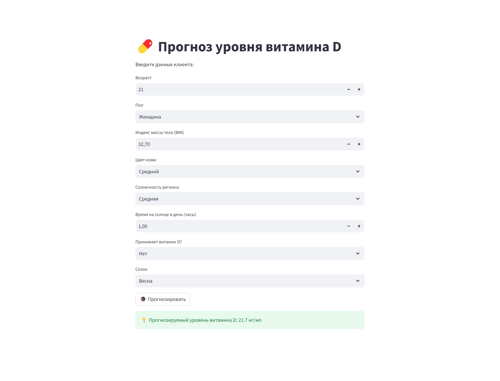

# Vitamin D Level Prediction App 🌞

Это интерактивное веб-приложение, созданное на Streamlit, которое прогнозирует уровень витамина D по анкетным данным клиента.

---

## 📋 Описание проекта

- Модель машинного обучения (линейная регрессия) обучена на синтетическом датасете с факторами, влияющими на уровень витамина D.
- Приложение позволяет вводить:
  - возраст,
  - пол,
  - индекс массы тела (BMI),
  - цвет кожи,
  - уровень солнечной активности региона,
  - время нахождения на солнце,
  - приём добавок витамина D,
  - сезон года.
- После ввода данных приложение прогнозирует предполагаемый уровень витамина D (нг/мл).

---

## 🚀 Как выглядит приложение

## 🚀 Пример использования

- Открыть приложение:  
  👉 [Vitamin D Prediction App](https://vitamin-d-ml-oadtc8fd4a4hk8kgeyt6fv.streamlit.app/)

- Ввести данные клиента.
- Нажать кнопку **"🔮 Прогнозировать"**.
- Получить прогнозируемый уровень витамина D.

---

## 🛠 Используемые технологии

- Python
- Streamlit
- Pandas
- NumPy
- scikit-learn

---

## 📄 Установка для локального запуска

1. Клонируйте репозиторий:
git clone https://github.com/azhar011090/Vitamin-D-ML.git

2. Перейдите в папку проекта:
cd Vitamin-D-ML

3. Установите зависимости:
pip install -r requirements.txt

4. Запустите приложение:
streamlit run vitamin_d_app.py

---

## 📬 Связь

Разработчик: Ажар Очкасова  
GitHub: [azhar011090](https://github.com/azhar011090)

